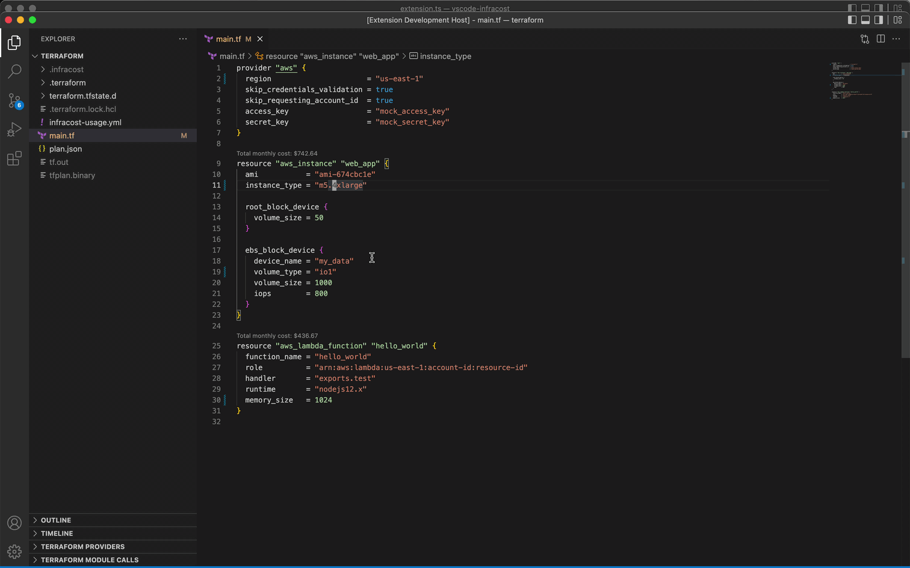
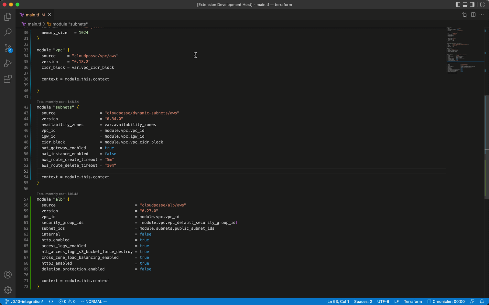
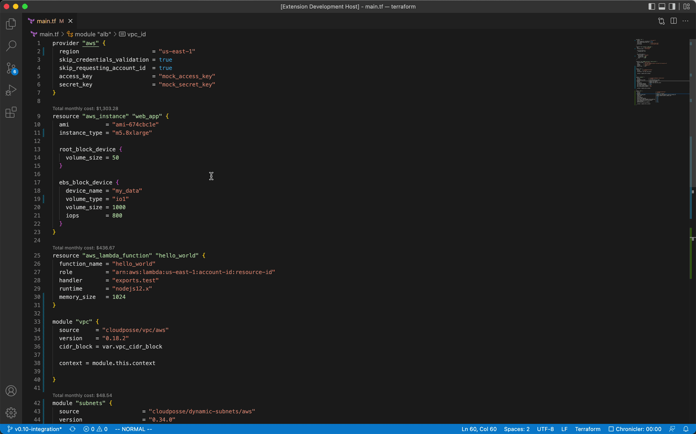

# Infracost VSCode Extension

Infracost's VSCode extension shows you cost estimates for Terraform right in your editor!

## Features

Infracost shows a snapshot of the total cost of resources right next to their Terraform definitions.

This feature is supported by both `resource` and `module` blocks, including **3rd party module blocks**!

View a detailed breakdown of costs on click. 

## Requirements

Infracost requires the [Terraform VSCode extension](https://marketplace.visualstudio.com/items?itemName=HashiCorp.terraform) to work. Please install this extension first. 

## Known Issues

* Infracost usage files are not yet supported
* Diff functionality is not yet supported

## Contributing

We love any kind of contribution, big or small.

To get the Infracost extension working locally:

1. Clone the repo.
2. `yarn` install all the dependencies.
3. Open the repo in VSCode.
4. Make sure the [Terraform VSCode extension](https://marketplace.visualstudio.com/items?itemName=HashiCorp.terraform) is installed.
5. Inside the editor, press F5. This will compile and run the extension in a new Extension Development Host window.
6. Open a Terraform file - if all the previous steps have been followed correctly you should see Infracost cost estimates above supported resource blocks.

Once you're happy with your contributions, send us a PR providing us additional context to the **what** and **why** of your changes.
