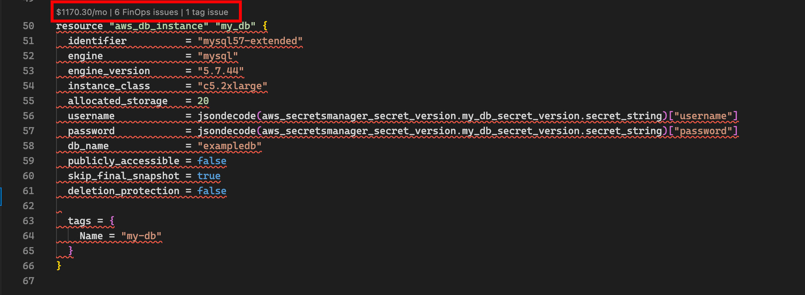
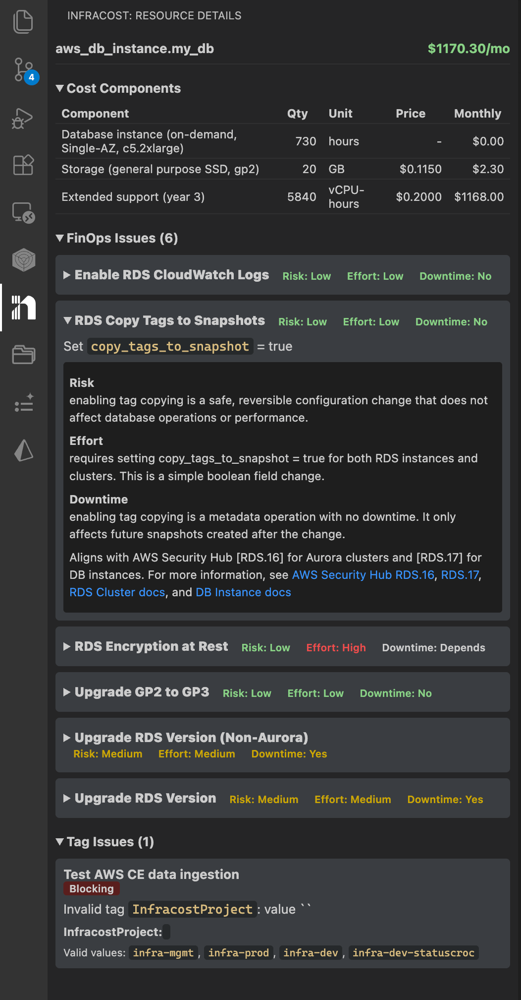
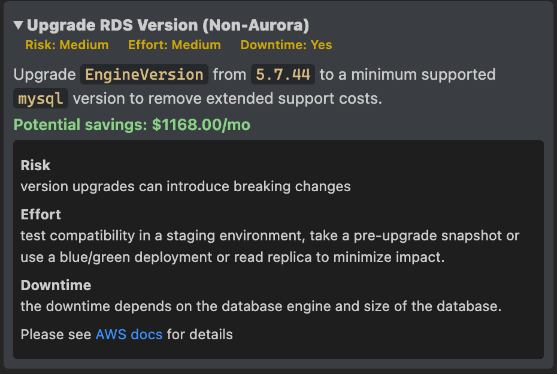
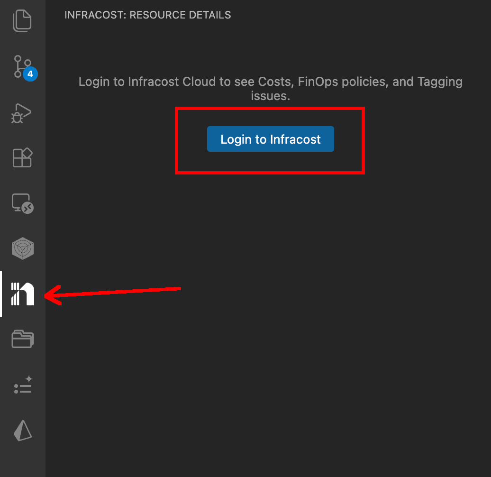

# Infracost VS Code Extension

Infracost's VS Code extension shows you cost estimates for Terraform right in your editor! It also surfaces FinOps policies and tagging issues so you can catch problems before they reach production.

## Features

## Cost estimates

### Inline cost estimates

See cost estimates as code lenses directly above Terraform resource definitions. Costs update as you edit.

<!-- TODO: screenshot of code lenses in a .tf file -->


### Resource details sidebar

Click a code lens to open the resource details panel, showing a full cost component breakdown, FinOps policy violations, and tagging issues.

<!-- TODO: screenshot of the resource details sidebar -->


### FinOps policies and tag issues

The extension highlights FinOps policy violations (with risk, effort, and potential savings) and tag policy issues directly in the sidebar. Blocking violations are clearly marked.

<!-- TODO: screenshot showing violations/tag issues in sidebar -->


### CloudFormation support

In addition to Terraform (`.tf`) files, the extension supports CloudFormation templates in YAML and JSON.

## Get started

### 1. Install the extension

Download the `.vsix` file for your platform from the [latest pre-release](https://github.com/infracost/vscode-infracost/releases). Then install it manually:

```sh
code --install-extension infracost-0.2.35-darwin-arm64.vsix
```

Or in VS Code: open the Command Palette (`Cmd+Shift+P` / `Ctrl+Shift+P`), run **Extensions: Install from VSIX...**, and select the downloaded file.

### 2. Login to Infracost

Open the Infracost sidebar and click **Login to Infracost**. This will open a browser window to authenticate your editor with your Infracost account.



### 3. Open a Terraform project

Open a workspace containing Terraform files. The extension will start the language server and begin scanning your project. Cost estimates will appear as code lenses above resource blocks.

### 4. Cost estimates in pull requests

[Use our CI/CD integrations](https://www.infracost.io/docs/integrations/cicd/) to add cost estimates to pull requests, giving your team visibility into cloud costs as part of your workflow.

## Requirements

* VS Code **v1.75.0** or above
* An [Infracost](https://www.infracost.io) account

## Configuration

| Setting | Description | Default |
|---------|-------------|---------|
| `infracost.serverPath` | Path to the `lsp` binary. Leave empty to use the bundled binary. | (bundled) |
| `infracost.runParamsCacheTTLSeconds` | How long (in seconds) to cache run parameters between API calls. Set to 0 to disable. | `300` |

## Commands

| Command | Description |
|---------|-------------|
| `Infracost: Login` | Authenticate with your Infracost account |
| `Infracost: Restart Language Server` | Restart the LSP if it gets into a bad state |

## Troubleshooting

### Locating logs

1. Open the Output panel (View -> Output).
2. Select **Infracost** from the dropdown to see language server logs.

If you're having issues, please [raise an issue](https://github.com/infracost/vscode-infracost/issues) with as much log information as you can, along with your OS and VS Code version.

## Contributing

1. Clone the repo.
2. `npm install` to install dependencies.
3. Open the repo in VS Code.
4. Press F5 to launch the extension in a Development Host window.
5. Open a Terraform project to see cost estimates above resource blocks.

Open a PR when you're ready and we'll review it.
